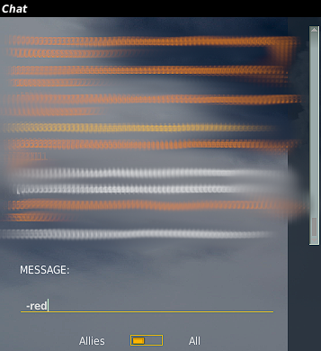

# Side Choosing

# Overview

You will need to choose a side to fly for in any given campaign. There are always two sides, red and blue, which have distinct advantages and disadvantages. The aircraft selection, starting positions and assets for both sides are different as well. It's very important you choose the side with the aircraft you wish to fly.

To play in a campaign you need to tell LSA which side you want to fly for. You can do this by typing either `-red` or `-blue` in the chat window.

Once you have selected a side you will be able to slot into aircraft belonging to that coalition.

:::warning

Once you have selected a side you cannot change it for the entire campaign.

:::
