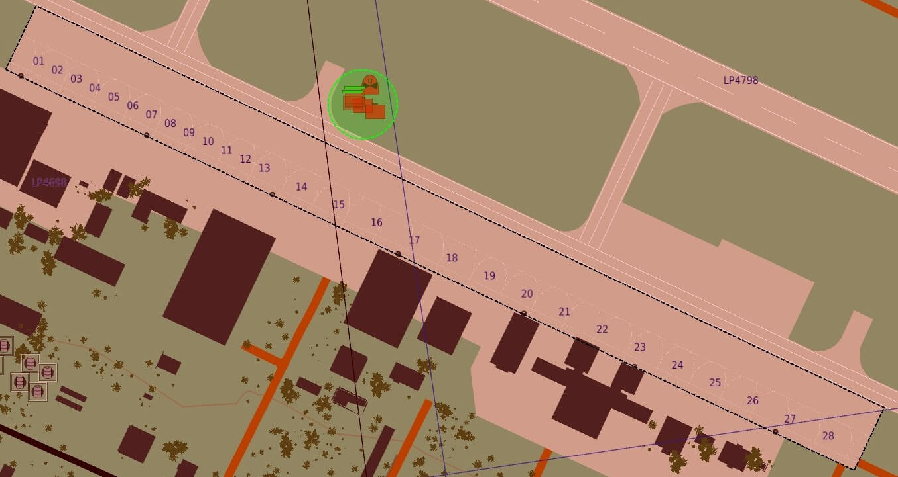

# Refuel and Rearm

# Overview

When you return to an airfield with the intention to refuel and re-arm you must exit the runway and return to the apron within 5 minutes of touchdown.

This rule will help keep the runway (and other airfield areas) clear of obstruction.

If you do not return to the apron within the 5 minutes, your aircraft will be destroyed and you will not get your life back.

It's worth noting that, if you reach the apron sooner that the 5 minutes, you must remain there until the 5 minute mark. 
If you leave the apron after having been there, then the system will consider that you have not been to the apron.

:::note

The apron areas are marked on the F10 map as dashed black rectangles.

:::

## Rotary

Due to the nature of helicopter landings, rotary aircraft are exempt from the rule of returning to the apron after landing.
However, if you are landing a helicopter and you wish to have your life returned, you must land and shutdown your engines inside the apron area. 

:::tip

See [Lives System](./5_lives-system.md) for more information.

:::