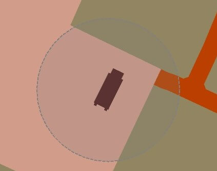

# Capture Objectives

# Overview

In order to achieve success, teams much work together to capture all the objectives on the map.

Objectives are normally composed of bases (airfields, FARPs, ships, etc...), defense forces and infrastructure.

To capture an objective a team must first destroy the assets at the base. Once the base is reduced to 30% capacity, a team can capture the objective.

The team will need to deploy a special forces squad to the capture zone marked on the F10 map.
The zone is represented by a gray circle.

Once the special forces are in place, they must remain alive for 10 minutes within that zone.
The base will be captured once the time has elapsed.