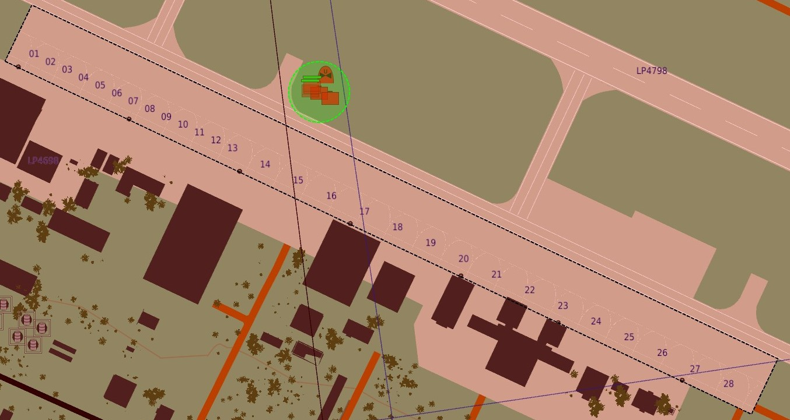

# Lives System

# Overview

Land, Sea and Air features a challenging lives system that will require you to manage your combat commitments carefully.

The system exist to induce a feeling of constrained resources, where the aircraft you fly are not infinitely available.

It works by allowing the player 3 lives in total.

If a player loses a life, a period of 3 hours is required to get it back. Combat, Search and Rescue is another way a life can be regained.
When a pilot is rescued by a CSAR unit, the associated player is awarded 1 life back.

Losing all 3 lives will result in the player not being able to slot into an aircraft.

## Live commit

A life is committed when a player starts his engines. 

Regardless of the location of a player, when the engines are started, the system will deduct a life from the available pool.

## Live return

A life is returned to the player when he shutdowns the engines inside the apron area.

The apron areas are marked on the F10 map as dashed black rectangles.

:::warning

If the player is outside this area and shuts down his engines, no life will be returned.

:::

## Combat Search and Rescue

A life is also returned to a player when he is rescued by a CSAR unit.

## Time

Once a life is lost, a period of 3h is required to pass, before that life is automatically returned to the player.